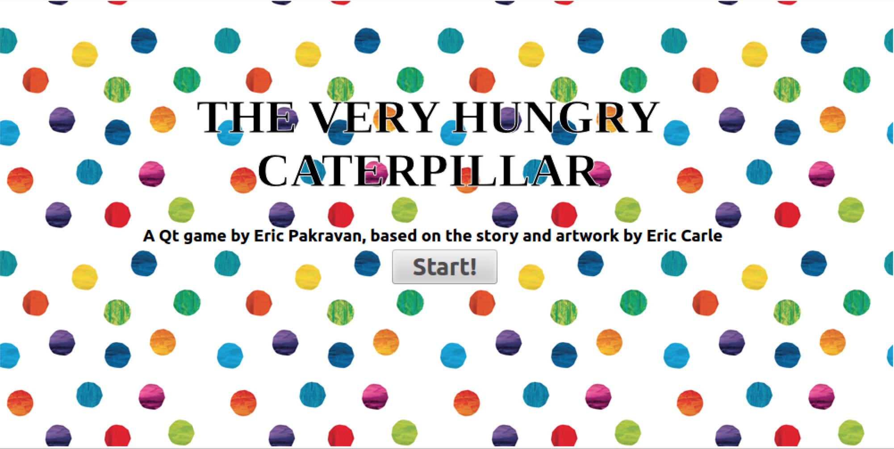

# Game - Programming Assignments Private Repository
### Student Information
  + Name: Eric Pakravan
  + USC Email: epakrava@usc.edu
  + USC ID: 9984726061

### Game Information
  + Game Name: myAwsomeGame
  + Game Description: One sentence game description
  + [Game Design Doc](GameDesignDoc.md)


### Compile & Run Instructions
The grader should use the following procedure to compile and run the code:
```shell
#Compile Instructions
echo "make clean all"
#Doxygen Instructions
echo "./game_epakrava"
```

### Screenshots
> 
> Screenshot during gameplay (four of five items on the board).
> 
> Screenshot with all items in play (a falling leaf can be seen at the bottom center).
> 